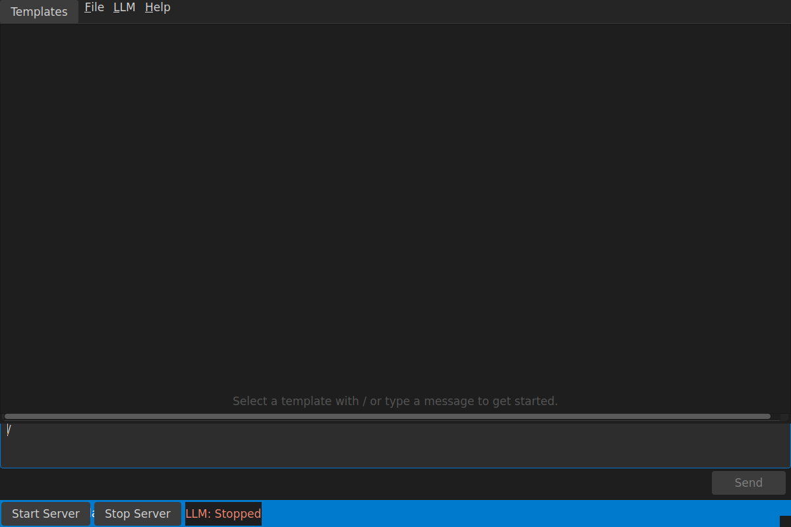
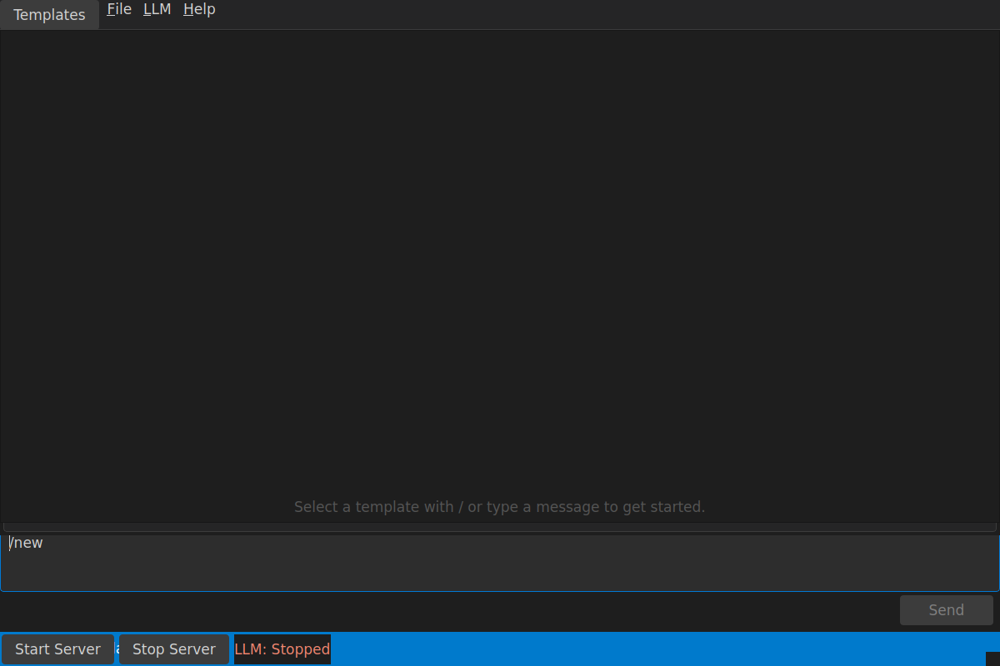

# Templatr

[](https://github.com/josiahH-cf/templatr/actions/workflows/ci.yml)
[](https://github.com/josiahH-cf/templatr/releases/latest)


**🔒 Create reusable AI prompts that run 100% on your computer.**

No cloud. No API keys. No subscriptions. Just you and your local AI.


---

## 🤔 What is Templatr?

Templatr helps you build **prompt templates** — reusable prompts with fill-in-the-blank variables. Think of them like **form letters for AI**: write once, reuse forever.

> 🛡️ **Your data stays private.** Everything runs on your computer. No internet required after initial setup. No accounts. Your prompts never leave your machine.

---

## ✨ Features

| | Feature | Description |
|---|---|---|
| 📝 | **Reusable Templates** | Create prompts with `{{variables}}` — fill in the blanks each time |
| 💬 | **[Multi-Turn Chat](docs/multi-turn-chat.md)** | Conversation memory — ask follow-ups naturally |
| 🧪 | **[A/B Testing](docs/prompt-ab-testing.md)** | Run a prompt multiple times and compare results side-by-side |
| 📊 | **[Performance Dashboard](docs/performance-dashboard.md)** | Track generation speed, token usage, and model stats |
| 🏪 | **[Template Marketplace](docs/template-marketplace.md)** | Browse and install community templates with one click |
| ⌨️ | **Slash Commands** | Type `/` to access templates, tools, and settings instantly |
| 🔌 | **Powered by llama.cpp** | Runs any `.gguf` model — fully offline |

---

## 📸 Screenshots

<table>
<tr>
<td align="center"><strong>Template Editor</strong></td>
<td align="center"><strong>Slash Command Palette</strong></td>
<td align="center"><strong>New Template Flow</strong></td>
</tr>
<tr>
<td></td>
<td></td>
<td></td>
</tr>
</table>

---

## 🚀 Quick Start

Download a pre-built binary from the [Releases page](https://github.com/josiahH-cf/templatr/releases/latest), or install from source.

<details>
<summary><strong>🐧 Linux (x86_64)</strong></summary>

**Pre-built binary:**
1. Download `templatr-linux.AppImage` from [Releases](https://github.com/josiahH-cf/templatr/releases/latest)
2. Make it executable: `chmod +x templatr-linux.AppImage`
3. Run it: `./templatr-linux.AppImage`

**From source:**
```bash
git clone https://github.com/josiahH-cf/templatr.git
cd templatr
./install.sh
```

</details>

<details>
<summary><strong>🍎 macOS</strong></summary>

1. Download the `.dmg` for your Mac from [Releases](https://github.com/josiahH-cf/templatr/releases/latest):
   - **Apple Silicon (M1/M2/M3):** `templatr-macos-latest.dmg`
   - **Intel:** `templatr-macos-13.dmg`
2. Open the `.dmg` and drag **Templatr** to Applications
3. Launch from Applications

**From source:**
```bash
git clone https://github.com/josiahH-cf/templatr.git
cd templatr
./install.sh
```

</details>

<details>
<summary><strong>🪟 Windows</strong></summary>

1. Download `templatr-windows.zip` from [Releases](https://github.com/josiahH-cf/templatr/releases/latest)
2. Extract to a folder of your choice
3. Run `templatr.exe`

> **For development:** Native Windows dev is not supported. Use [WSL2](https://learn.microsoft.com/en-us/windows/wsl/install) — see [CONTRIBUTING.md](CONTRIBUTING.md).

</details>

---

## 🤖 Getting an AI Model

You need a `.gguf` model file — this is the "brain" that generates responses.

1. Launch Templatr
2. Go to **LLM → Download Models (Hugging Face)**
3. Download any model (start small, around 3–8 GB)
4. Go to **LLM → Select Model → Add Model from File...**
5. Pick your downloaded `.gguf` file

> **💡 Tip:** Smaller models run faster. Larger ones are smarter but slower. Any `.gguf` format model works — browse [Hugging Face](https://huggingface.co/models?search=gguf) for options.

---

## 📝 Creating Your First Template

1. Open the chat and type `/new`
2. Give your template a name (e.g., "Code Review")
3. Write your prompt using `{{variables}}` for the blanks:
   ```
   Review this {{language}} code for bugs and improvements:

   {{code}}
   ```
4. Your template is saved and immediately available as a `/` command

📖 See the full [Template Authoring Guide](docs/templates.md) for import/export and advanced editing.

---

## 💻 System Requirements

| Requirement | Minimum |
|-------------|---------|
| **OS** | Linux (x86_64), macOS (Intel or Apple Silicon), or Windows 10+ |
| **Python** | 3.10+ (source install only — not needed for pre-built binaries) |
| **RAM** | 8 GB (16 GB recommended) |
| **Storage** | 10 GB free for models |

---

## ❓ FAQ

**Q: Do I need internet?**
A: Only to download the app and a model. After that, everything works offline.

**Q: Is it free?**
A: Yes, completely free and open source (MIT license).

**Q: What models work?**
A: Any `.gguf` format model. Browse [Hugging Face](https://huggingface.co/models?search=gguf) for options.

**Q: It's slow. What can I do?**
A: Use a smaller model, or upgrade your hardware. A GPU helps significantly.

**Q: Is there an Espanso integration?**
A: Espanso support lives in a separate project: [templatr-espanso](https://github.com/josiahH-cf/templatr-espanso).

---

## 📂 File Locations

<details>
<summary><strong>Linux / WSL2</strong></summary>

| What | Location |
|------|----------|
| Settings & Templates | `~/.config/templatr/` |
| LLM Server | `~/.local/share/templatr/` |
| Models | `~/models/` |

</details>

<details>
<summary><strong>macOS</strong></summary>

| What | Location |
|------|----------|
| Settings & Templates | `~/Library/Application Support/templatr/` |
| Models | `~/models/` |

</details>

<details>
<summary><strong>Windows</strong></summary>

| What | Location |
|------|----------|
| Settings & Templates | `%APPDATA%\templatr\` |
| Data | `%LOCALAPPDATA%\templatr\` |
| Models | `%USERPROFILE%\models\` |

</details>

> **💡 Tip:** Run `templatr --doctor` to see your exact paths and check for missing dependencies.

---

## 📚 Documentation

- [Template Authoring Guide](docs/templates.md)
- [Multi-Turn Chat](docs/multi-turn-chat.md)
- [Prompt A/B Testing](docs/prompt-ab-testing.md)
- [Performance Dashboard](docs/performance-dashboard.md)
- [Template Marketplace](docs/template-marketplace.md)
- Troubleshooting: [Linux](docs/troubleshooting-linux.md) · [macOS](docs/troubleshooting-macos.md) · [Windows](docs/troubleshooting-windows.md)

---

## 🤝 Contributing

We'd love your help! Whether it's bug reports, feature ideas, or code — all contributions are welcome.

See [CONTRIBUTING.md](CONTRIBUTING.md) for developer setup, testing, and PR guidelines.

---

## License

MIT — see [LICENSE](LICENSE) for details.

---

<p align="center">
  Made with ❤️ for people who value privacy
</p>
