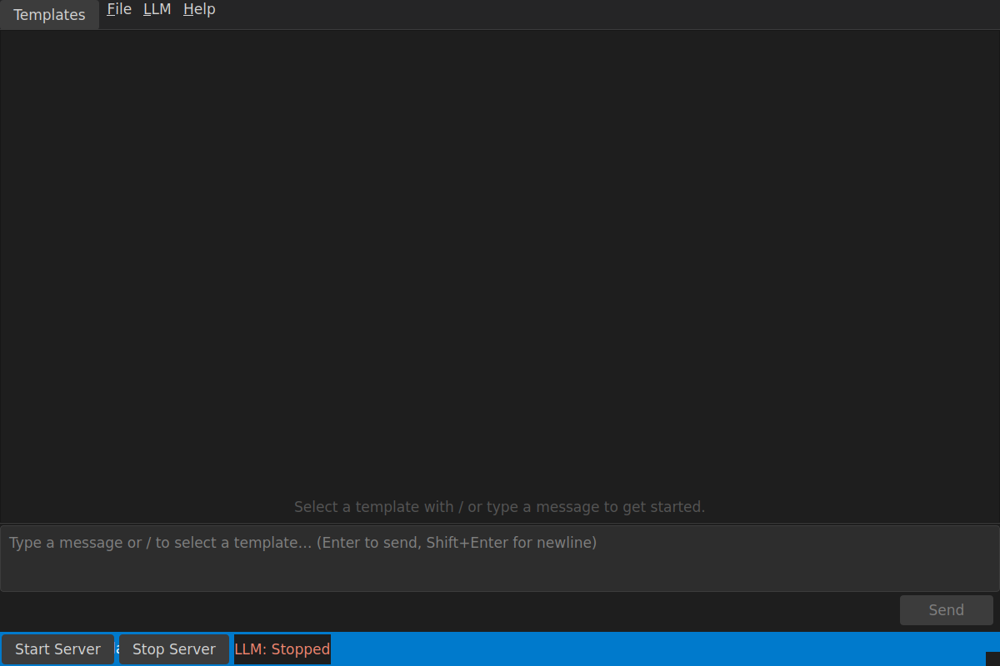

# Templatr

[](https://github.com/josiahH-cf/templatr/actions/workflows/ci.yml)
[](https://github.com/josiahH-cf/templatr/releases/latest)


**Create reusable AI prompts that run 100% on your computer.**

No cloud. No API keys. No subscriptions. Just you and your local AI.



---

## What is Templatr?

Templatr helps you build **prompt templates** — reusable prompts with fill-in-the-blank variables. Think of them like form letters for AI.

**Example:** Instead of retyping "Review this code for bugs..." every time, create a template once and reuse it forever.

### Your Data Stays Private

Everything runs on your computer:

- No internet connection required (after initial setup)
- No accounts or sign-ups
- Your prompts never leave your machine

---

## Quick Start

### Linux (x86_64)

Pre-built binaries are available for x86_64 Linux. ARM64 is not yet supported for pre-built releases.

1. Go to the [Releases page](https://github.com/josiahH-cf/templatr/releases/latest)
2. Download `templatr-linux.AppImage` (or the `.AppDir` fallback)
3. Make it executable:
   ```bash
   chmod +x templatr-linux.AppImage
   ```
4. Run it:
   ```bash
   ./templatr-linux.AppImage
   ```

**Developer install (from source):**
```bash
git clone https://github.com/josiahH-cf/templatr.git
cd templatr
./install.sh
```

### macOS

1. Go to the [Releases page](https://github.com/josiahH-cf/templatr/releases/latest)
2. Download the `.dmg` for your architecture:
   - **Apple Silicon (M1/M2/M3):** `templatr-macos-latest.dmg`
   - **Intel:** `templatr-macos-13.dmg`
3. Open the `.dmg` and drag **Templatr** to Applications
4. Launch Templatr from Applications

**Developer install (from source):**
```bash
git clone https://github.com/josiahH-cf/templatr.git
cd templatr
./install.sh
```

### Windows

> **Note:** Native Windows development builds are not yet supported. For development, use WSL2 (see [CONTRIBUTING.md](CONTRIBUTING.md)).

1. Go to the [Releases page](https://github.com/josiahH-cf/templatr/releases/latest)
2. Download the `templatr-windows.zip`
3. Extract the zip to a folder of your choice
4. Run `templatr.exe` from the extracted folder

---

## Getting an AI Model

You need a `.gguf` model file — this is the "brain" that generates responses.

1. Launch Templatr
2. Go to **LLM → Download Models (Hugging Face)**
3. Download any model (start small, around 3–8 GB)
4. Go to **LLM → Select Model → Add Model from File...**
5. Pick your downloaded `.gguf` file

**Tip:** Smaller models run faster. Larger ones are smarter but slower. Any `.gguf` format model works — browse [Hugging Face](https://huggingface.co/models?search=gguf) for options.

---

## Creating Your First Template

1. Open the chat and type `/new`
2. Give your template a name (e.g., "Code Review")
3. Write your prompt using `{{variables}}` for the blanks:
   ```
   Review this {{language}} code for bugs and improvements:

   {{code}}
   ```
4. Your template is saved and immediately available as a `/` command

See [TEMPLATES.md](TEMPLATES.md) for the full template authoring guide, including import/export and advanced editing.

---

## System Requirements

| Requirement | Minimum |
|-------------|---------|
| **OS** | Linux (x86_64), macOS (Intel or Apple Silicon), or Windows 10+ |
| **Python** | 3.10 or newer (source install only; not needed for pre-built binaries) |
| **RAM** | 8 GB (16 GB recommended) |
| **Storage** | 10 GB free for models |

---

## Where Files Are Stored

### Linux / WSL2

| What | Location |
|------|----------|
| Settings & Templates | `~/.config/templatr/` (or `$XDG_CONFIG_HOME/templatr/`) |
| LLM Server | `~/.local/share/templatr/` (or `$XDG_DATA_HOME/templatr/`) |
| Models | `~/models/` |

### macOS

| What | Location |
|------|----------|
| Settings & Templates | `~/Library/Application Support/templatr/` |
| Models | `~/models/` |

### Windows (pre-built binary)

| What | Location |
|------|----------|
| Settings & Templates | `%APPDATA%\templatr\` |
| Data | `%LOCALAPPDATA%\templatr\` |
| Models | `%USERPROFILE%\models\` |

> **Tip:** Run `templatr --doctor` to see your exact platform-specific paths and check for missing dependencies.

**To remove everything:**
```bash
# Linux / WSL2
rm -rf ~/.config/templatr/ ~/.local/share/templatr/ ~/models/*.gguf

# macOS
rm -rf ~/Library/Application\ Support/templatr/ ~/models/*.gguf

# Windows (PowerShell)
Remove-Item -Recurse "$env:APPDATA\templatr", "$env:LOCALAPPDATA\templatr"
```

---

## Common Questions

**Q: Do I need internet?**
A: Only to download the app and a model. After that, everything works offline.

**Q: Is it free?**
A: Yes, completely free and open source (MIT license).

**Q: What models work?**
A: Any `.gguf` format model. Browse [Hugging Face](https://huggingface.co/models?search=gguf) for options.

**Q: It's slow. What can I do?**
A: Use a smaller model, or upgrade your hardware. A GPU helps significantly.

**Q: Is there an Espanso integration?**
A: Espanso support lives in a separate project: [templatr-espanso](https://github.com/josiahH-cf/templatr-espanso).

---

## Template Marketplace

Templatr includes a built-in community catalog of prompt templates you can browse and install without leaving the app.

### Browsing the catalog

In the chat bar, type `/browse` and press Enter.  A dialog opens that lets you:

- **Search** by name, description, author, or tag in real time.
- **Filter by tag** using the tag drop-down.
- **Preview** a template's full details before installing.
- **Install** any template with one click — it is downloaded, validated, and added to your template library immediately.

After install, the template tree on the left refreshes automatically and the template is ready to use.

### Contributing a template

Community templates live in the [templatr-catalog](https://github.com/josiahH-cf/templatr-catalog) repository.

1. **Test locally first** — use `/import` in Templatr to import your `.json` template file and confirm it works.
2. **Fork** `josiahH-cf/templatr-catalog`.
3. Add your template file under `templates/` (lowercase snake_case filename, e.g. `my_great_template.json`).
4. Add an entry to `catalog.json` with the required fields: `name`, `description`, `author`, `tags`, `version`, and `download_url` pointing to the raw file URL.
5. Open a Pull Request — see [CONTRIBUTING](https://github.com/josiahH-cf/templatr-catalog/blob/main/CONTRIBUTING.md) for requirements.

### Hosting a private catalog

You can point Templatr at any URL that serves a valid catalog JSON array.

1. Fork the catalog repo (or create your own with the same format).
2. In Templatr, open `/settings` and change **Catalog URL** to the raw URL of your `catalog.json`.
3. Use `/browse` as normal — Templatr fetches from your URL.

This works for company-internal libraries, team collections, or curated personal sets.

---

## Multi-Turn Chat

Templatr remembers prior exchanges within a session so you can ask follow-up
questions and refine outputs naturally — no copy-pasting required.

### How it works

Every message you send automatically includes recent user/assistant turns as
context.  The model sees the conversation history, so you can say things like
"make that shorter" or "now write a Python example" and the model understands
what *that* refers to.

### Resetting the conversation

Two things reset the context and start a clean slate:

- Press **Ctrl+L** or use the `/clear` keyboard shortcut.
- Select a different template from the slash palette or sidebar.

### Settings

Open `/settings` and adjust under **Generation Settings**:

| Setting | Default | Description |
|---------|---------|-------------|
| Conversation Turns | 6 | Number of prior user/assistant pairs included. Set to **0** to disable memory entirely (single-shot mode). |
| Context Char Limit | 4000 | Maximum characters of assembled context per request. Oldest turns are silently dropped when the limit is hit — a notice appears in the chat. |

---

## Contributing

See [CONTRIBUTING.md](CONTRIBUTING.md) for developer setup, testing, and PR guidelines.

---

## License

MIT — see [LICENSE](LICENSE) for details.

---

<p align="center">
  Made with care for people who value privacy
</p>
